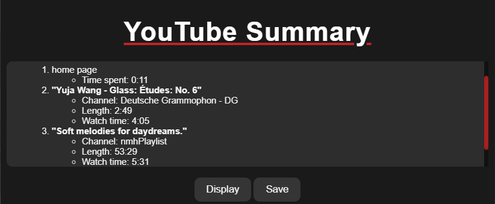
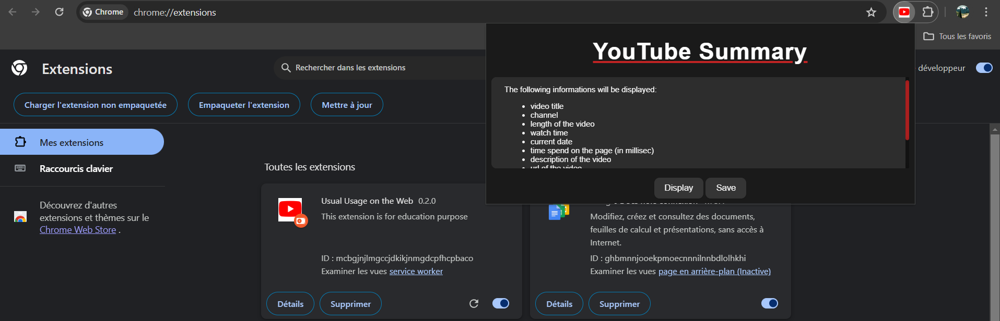
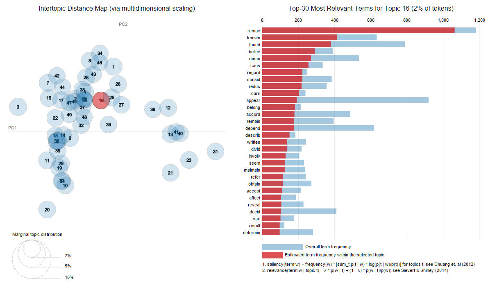
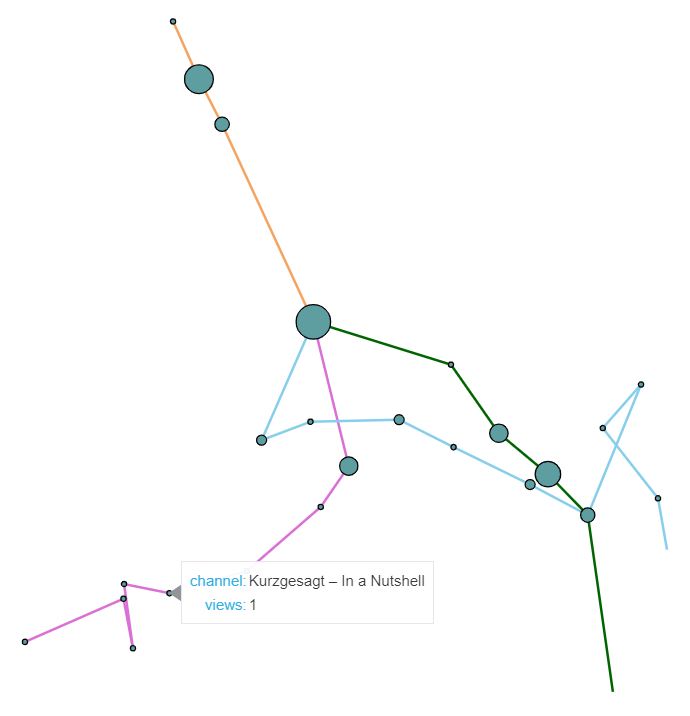
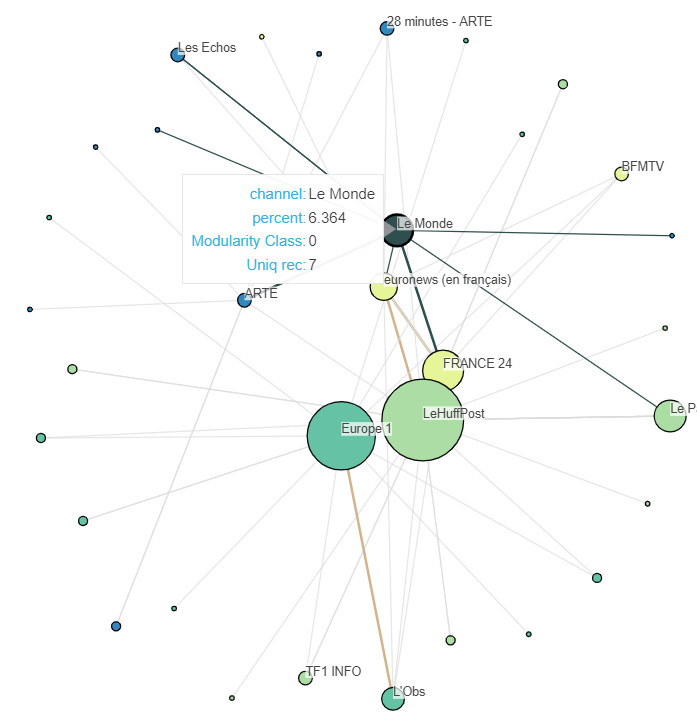

# A Youtube Extension

The purpose of this extension is to save informations related to the user navigation on youtube.
This extension make the collect of data independant from API such as YouTube's API in a context were social platforms' API and access to data are more and more restricted.

## Description

The extension collects informations such as:
* video title
* channel name
* video length
* video description
* associated tags
* time spent on page
* viewing time
* top 10 recommendations

The extension was made to have an insight on the answers of questions such as:
* To what extent will users on different jobs and accounts be directed by an algorithm to the same sources for a research assignment?
* How similar or dissimilar are YouTube recommendations from one person to another? 
* What percentage of videos do user experiences have in common with those suggested by YouTube data tools?
* For a given video on a controversial topic, which "camp" does YouTube direct the user to? After how many videos does YouTube direct the user to a completely different topic?
* For a given theme, in autoplay, after how many recommended videos does the theme change?

## Installing
Follow the instructions in  `Installation.pdf`

The APIs used are as follows
* runtime: to send messages and listen to replies.
* storage: to access storage
* windows: to access the url of the page being loaded

## Description Analysis
In `Notebook_analyse.ipynb` are functions to create a cloud of words and perform LSA/LDA analysis.

note: the intertopic distance map is an illustration of what the function can do but is comming from [here](https://stackoverflow.com/questions/32531031/calculate-intertopic-distances-from-ldavis-package)

## Representation
In `data_processing.ipynb` are functions to represent the navigation of multiple users and the recommendations of one user in a graph.

Each colored line represents a user's journey. Nodes correspond to YouTube channels. The larger the node, the greater the number of videos viewed by the channel. 

one_navigation_recommendation.

The way these graphs are created is as follows: when browsing YouTube, the links, titles and chains of the first 10 recommendations appearing when a video is played are recorded. The network links together the chains of videos that have been viewed successively, with a brown line. In gray, the recommendation chains are linked to the chains of the videos that recommended them.

